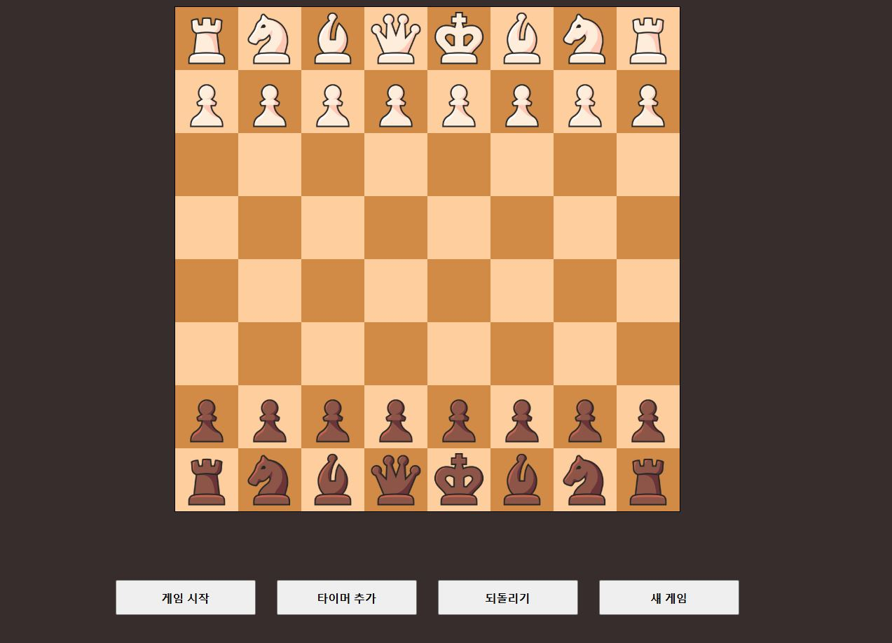
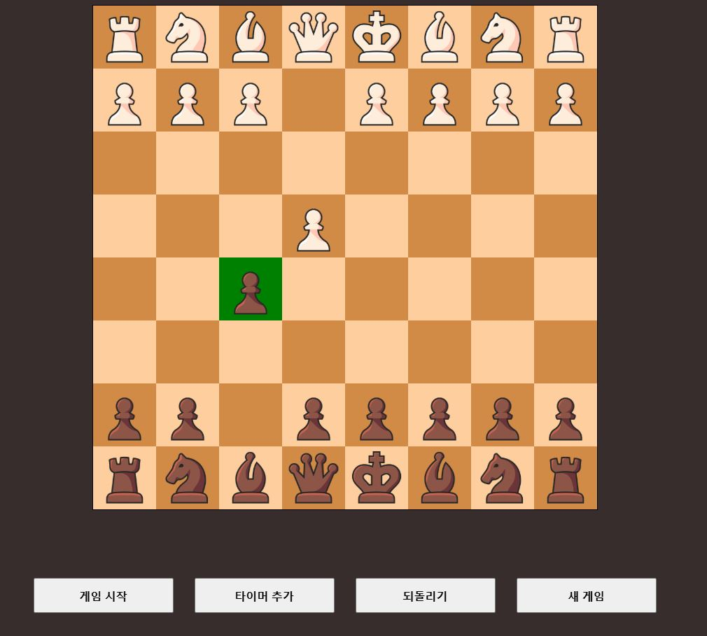
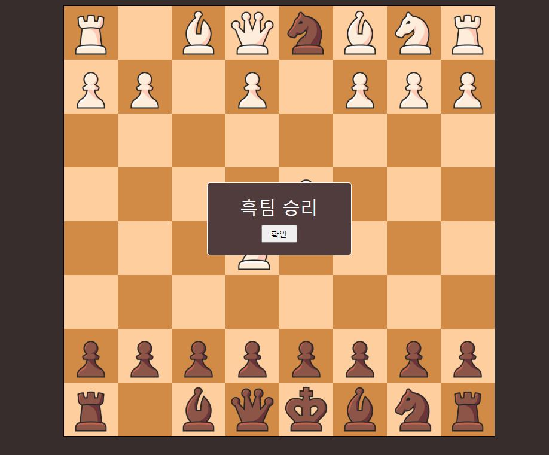

# chess

This project was created to practice Vue by implementing chess. Although I was unable to implement castling, one of the special rules of chess, I plan to implement it in a future chess project using React.

link : https://hogeun1999.github.io/chess/

## main UI

There is a main chessboard in the center, and below it are four buttons necessary for the game.

## Button Feature

### 1. Game Start

- You cannot move the pieces before pressing the start game button.
- After pressing the start game button, the selected piece will turn green.
- And when you click on a valid move square, the piece will move.

### 2. Add Tiemr

- When the 'Add Timer' button is pressed, a timer will appear on the right side of the chessboard.
- If the game is played with the timer window open, the time will automatically pass.
- When the stop timer button in the center is pressed, the timer will stop. Pressing it again will start the timer.
- The timer follows the Fischer rule, granting an additional 20 seconds after each move.

### 3. Undo Button

- Pressing the undo button in the third position will allow you to revert the last move.
- Please note that the additional time gained will not be reversed, so think carefully.

### 4. New Game

- Pressing the 'New Game' button will allow you to start the game from the beginning.
- The timer will also reset to its initial state.
- To start the game again, press the 'Start Game' button and play.

## End Game
- You win by capturing the opponent's king.
- You lose if you run out of time.
- There is no check or checkmate feature.

## Scheduled for modification

1. Since this is a project for practicing Vue, I will not make any changes except for fixing bugs in the current version.

2. I plan to improve and implement features like check, checkmate, and castling in a React project.